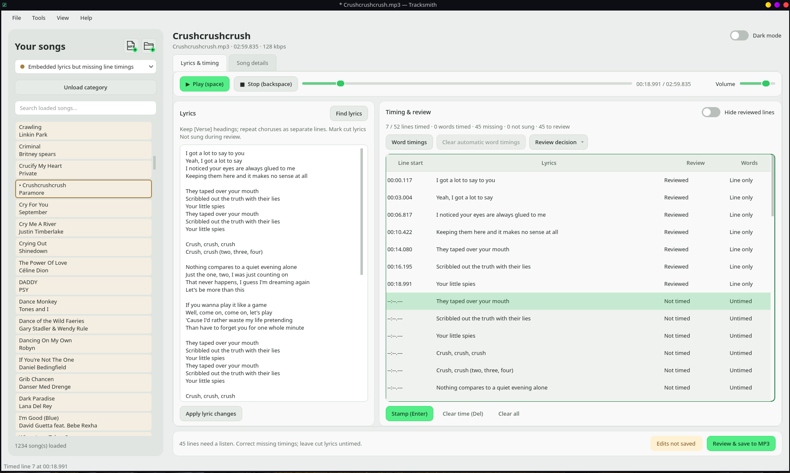

# Tracksmith

Find and embed lyrics, create line and word timings, and find relevant album covers for your MP3 collection. Tracksmith is a Python/PySide6 desktop app with batch tools for lyrics and cover art, plus timing tools that work against your own recording—including edited songs with cuts or repeated sections.



## Features

- **Find and embed lyrics:** search LRCLIB, compare and edit results, then save lyrics directly into the MP3. Find and save lyrics for multiple files with the batch tool, or paste your own text.
- **Create timed lyrics:** stamp line starts during playback or generate line and word timings with optional local Whisper analysis. Adjust line timestamps and word boundaries, loop sections, and review timings by listening. Embed line timings and available word timings directly in the MP3, including exact word ends. Copying the MP3 carries its timings with it; no companion file is required. Files with only line timings keep working, and word timings can be added later.
- **Find and embed album covers:** search for relevant album artwork through MusicBrainz and Cover Art Archive, preview editions, and choose a cover to save into the MP3. For a collection, find missing covers in batch and accept suggestions in a visual review grid before saving. You can also load a local image.
- **Also update song metadata:** find suggested title, artist, album, album artist, date and track number, choose which fields to apply, or edit tags manually, including genre.

Load individual songs or whole folders, then search and filter your collection by saved lyrics and timing completeness. Batch tools also generate missing line timings. Individual saves show a change review; MP3 writes are atomic and verify that the compressed audio remains unchanged.

## Install and run

### Linux installers

Download the **AppImage** or **.deb** from [GitHub Releases](https://github.com/tefaz/Tracksmith-mp3-enricher/releases/latest). These x86_64 packages include Python and the GUI dependencies and target Linux desktops with glibc 2.34 or newer (such as Ubuntu 22.04+ and Debian 12+).

For Debian/Ubuntu, install the downloaded package and its system dependencies:

```bash
sudo apt install ./tracksmith_0.2.0_amd64.deb
tracksmith
```

For the AppImage, install FFmpeg through your distribution’s package manager, then run:

```bash
chmod +x Tracksmith-0.2.0-x86_64.AppImage
./Tracksmith-0.2.0-x86_64.AppImage
# If FUSE is unavailable:
./Tracksmith-0.2.0-x86_64.AppImage --appimage-extract-and-run
```

The installers support lyric and cover lookup, batch operations, manual line/word timing and MP3 saves immediately. Optional CPU analysis packages are installed separately; model files download on first analysis:

```bash
tracksmith --install-ai
# Or, for the AppImage:
./Tracksmith-0.2.0-x86_64.AppImage --install-ai
```

Analysis packages live under `$XDG_DATA_HOME/tracksmith/analysis` (normally `~/.local/share/tracksmith/analysis`). Saved word timings remain embedded in the MP3. A working desktop audio service and standard desktop graphics libraries are required. The Debian package declares its system dependencies; the AppImage bundles additional XCB helper libraries. Optional AcoustID verification needs `fpcalc` and your own application key.

### Run from source

Requires **Python 3.11+** (3.12 recommended), **FFmpeg**, and a working desktop audio service. Linux is the primary development platform. Chromaprint (`fpcalc`) is optional for AcoustID identification; AI packages are optional.

```bash
git clone git@github.com:tefaz/Tracksmith-mp3-enricher.git
cd Tracksmith-mp3-enricher
python3.12 -m venv .venv
source .venv/bin/activate
python -m pip install -e .
tracksmith
```

On Arch/CachyOS, install the system dependencies with:

```bash
sudo pacman -S ffmpeg libsndfile libxcb libxkbcommon-x11 xcb-util-cursor
# Optional fingerprint identification:
sudo pacman -S chromaprint
```

You can also run `./start.sh` (uses this folder's `.venv`) or open a file directly:

```bash
python -m tracksmith /path/to/song.mp3
```

The included `tracksmith.desktop` launcher uses absolute paths; update its `Exec`, `TryExec`, `Path` and `Icon` entries for your checkout before installing it in your application menu.

### Optional automatic timing from source

For CPU analysis, install CPU PyTorch before the AI extra:

```bash
source .venv/bin/activate
python -m pip install torch --index-url https://download.pytorch.org/whl/cpu
python -m pip install -e '.[ai]'
# Optional vocal separation:
python -m pip install -e '.[separation]'
```

Select the model, language and device in **Tools → Settings → Audio analysis**, then use **Tools → Automatic timing → Analyze timing**. The default is Whisper `small` on CPU. Models download on first use; allow several GB for packages and checkpoints. Analysis runs locally in a cancellable process.

Automatic singing alignment is experimental. Review generated timings by listening; support scores are heuristics. Downloaded lyric timestamps are discarded so they do not silently become timings for a different recording. Tracksmith prepares embedded timings for karaoke players; it does not provide a karaoke presentation view.

## Typical workflow

1. Load one or more MP3s or a folder.
2. Find and edit lyrics, or use **Tools → Batch: find and save lyrics** for multiple files.
3. To add timing, apply lyric changes and stamp line starts manually or run optional analysis. Correct line and word timings while listening.
4. Find an album cover for a song, or select a category and use **Tools → Selected category: add missing album covers** to review batch suggestions. Update other song metadata as needed.
5. Use **Review & save to MP3** to inspect and save individual edits. Batch lyrics and accepted batch covers save through their respective tools.

Lyrics and covers can be saved without creating timings. Opening a song is read-only. Manual work requires no account or network connection.

## Storage and online services

**Saved word timings travel with the MP3.** Nightwave can read the embedded word starts for karaoke highlighting while continuing to support songs with only line timings. Copying a newly saved word-timed MP3 to another folder or computer preserves its timings without Tracksmith’s app-data folder. JSON timing projects are optional exports for editing and sharing.

- **Inside the MP3:** metadata, artwork, plain lyrics (USLT), line and word starts (SYLT), plus exact word ends and editing data in an additional embedded timing frame, saved as ID3v2.4 without re-encoding audio. Saves create no permanent companion files or backups.
- **Application data:** presentation preferences live under `~/.local/share/tracksmith` by default. Tracksmith also keeps a compatibility copy of saved timing/review data under its `timings/` directory, supporting older files whose word timings were stored separately. Newly embedded word timings do not depend on this copy.
- **Settings:** `~/.config/tracksmith/settings.json`.
- **Disposable caches and logs:** `~/.cache/tracksmith`; use **Tools → Manage disposable caches** to clean cached results while keeping corrected timings.

Existing installations retain access to legacy `song-metadata-enricher` storage and embedded lyric tags. Settings load from the old location when needed and are subsequently saved under `tracksmith`; existing custom storage locations remain in use.

Paths follow `XDG_DATA_HOME`, `XDG_CONFIG_HOME` and `XDG_CACHE_HOME`; some locations are configurable in Settings.

MusicBrainz, Cover Art Archive and LRCLIB searches need internet access but no account. Optional AcoustID identification needs your own application key and `fpcalc`; it sends a fingerprint and duration, not the audio file. Batch cover suggestions always require image review before saving. Use lyrics and artwork according to provider terms and applicable rights.

## Development

```bash
source .venv/bin/activate
python -m pip install -e '.[dev]'
QT_QPA_PLATFORM=offscreen pytest -q
ruff check src tests scripts
ruff format --check src tests scripts
```

Tests use generated tone MP3s and mocked online/model services. FFmpeg is required; Qt playback tests also need access to a desktop audio service. Keep private music and evaluation files in the ignored `local-fixtures/` folder.

- [Detailed guide](docs/USER_GUIDE.md): shortcuts, timing workflows, optional backends and save verification.
- [Implementation status](IMPLEMENTATION_STATUS.md): implementation and validation notes.
- [Improvement backlog](suggested-improvement.md): design rationale and UX requirements.

Report bugs or propose changes through [GitHub issues](https://github.com/tefaz/Tracksmith-mp3-enricher/issues); include reproduction steps, environment details and relevant errors without private keys or music files.

### Build Linux release packages

On Linux x86_64, with Python 3.12+, `ar`, and internet access:

```bash
python scripts/build_release.py
python scripts/smoke_release.py
```

The builder downloads checksum-verified portable Python and AppImage tooling, installs the pinned base dependencies, and writes the AppImage, Debian package and `SHA256SUMS` to `dist/`. It does not package the developer’s virtual environment, credentials or personal settings. Optional analysis packages and model weights are excluded.

## License

No license has been selected for this repository yet.
